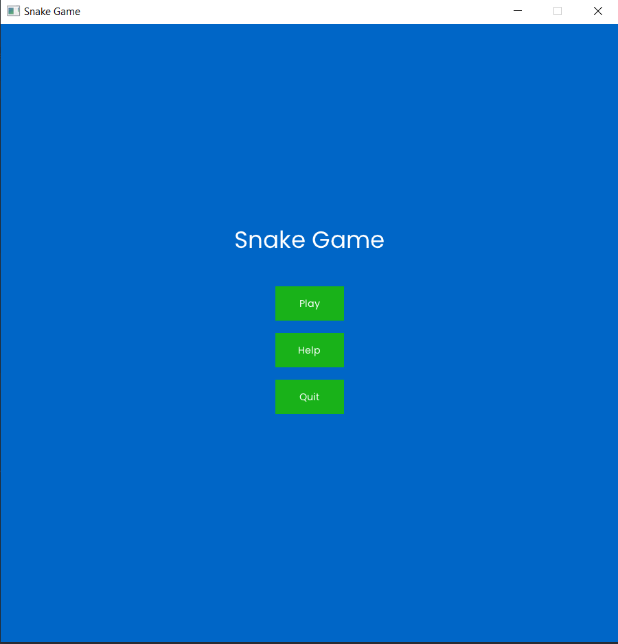
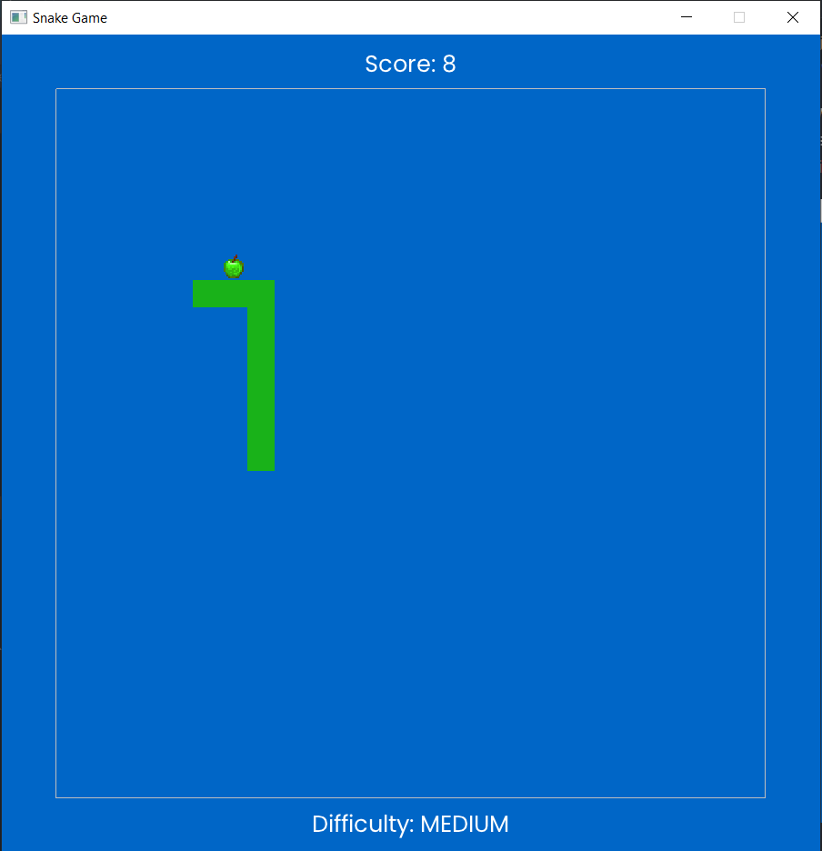
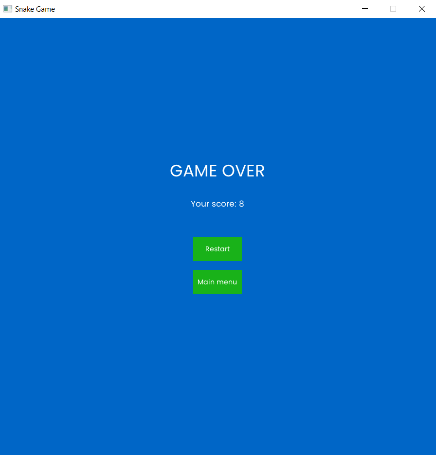

# Snake Game

This is a modern rendition of the classic Snake game implemented in Java, using the Lightweight Java Game Library (LWJGL) for graphical rendering. The game features adjustable difficulty settings and utilizes OpenGL and NanoVG for rendering graphics.

## Features
- Adjustable difficulty levels (Easy, Medium, Hard)
- Smooth graphics rendering with LWJGL and OpenGL
- High-resolution textures and modern UI
- Real-time game speed adjustments

## Prerequisites

To run this game, you'll need the following installed on your machine:

- Java JDK 17 or higher
- Lightweight Java Game Library (LWJGL) version 3.2.3

## Installation

1. Clone the Repository to your local machine:
    ```bash
      git clone https://github.com/VelikanovDev/Snake-Game.git
      cd SnakeGame 
    ```
2. Download Lightweight Java Game Library (LWJGL) version 3.2.3 from the official [website](https://www.lwjgl.org/).
   After downloading LWJGL, you need to set up the library in your IDE to run the Snake Game.

## Running the Game
Once you've set up the project and its dependencies, running the game is straightforward. Below are the steps for both IntelliJ IDEA and Eclipse, two popular Java IDEs.
* **IntelliJ IDEA**
  1. Open the Project: Open IntelliJ IDEA, select "Open" and navigate to the project directory.
  2. Run the Game: Find SnakeGame.java in the project explorer, right-click it, and select "Run 'SnakeGame.main()'". This will start the game.

* **Eclipse**
  1. Open the Project: Open Eclipse, go to "File > Open Projects from File System..." and import the project.
  2. Run the Game: In the Package Explorer, right-click on SnakeGame.java and select "Run As > Java Application". The game window should appear.

## Controls
- **Arrow Keys**: Use the arrow keys to control the snake's direction.
- **R**: Restart the game at any time.
- **Q**: Quit the game.



